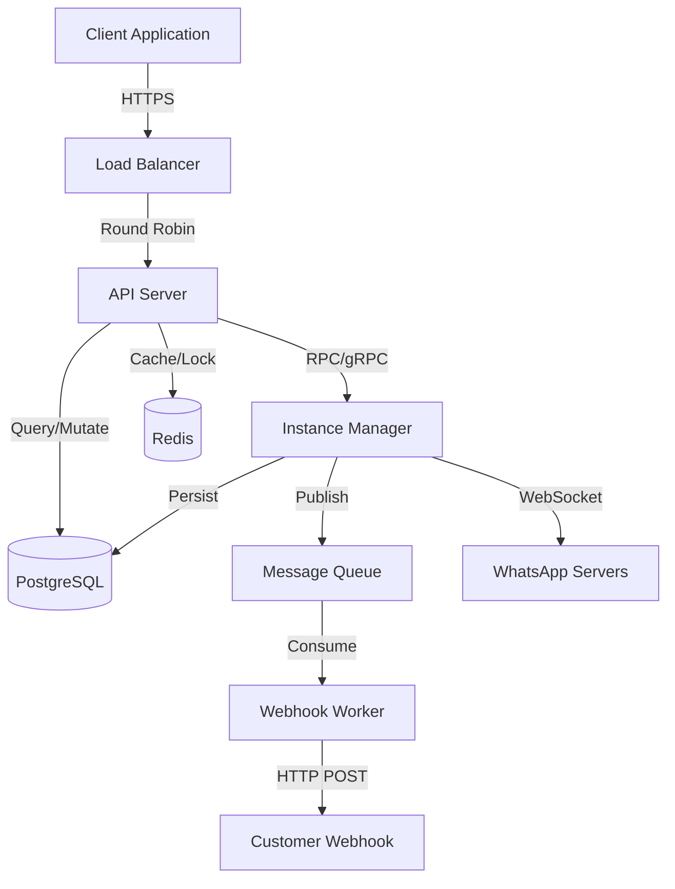

# Architecture Documentation
# WhatsApp Meta API Adapter - Enterprise Edition

**Version:** 2.0.0
**Last Updated:** 2025-01-18
**Status:** FINAL DESIGN
**Reviewers:** Engineering Lead, Security Team, DevOps

---

## Table of Contents

1. [Executive Summary](#1-executive-summary)
2. [Architecture Overview](#2-architecture-overview)
3. [System Components](#3-system-components)
4. [Data Flow](#4-data-flow)
5. [Multi-Tenancy Design](#5-multi-tenancy-design)
6. [Security Architecture](#6-security-architecture)
7. [Scalability & Performance](#7-scalability--performance)
8. [High Availability](#8-high-availability)
9. [Deployment Architecture](#9-deployment-architecture)
10. [Technology Decisions](#10-technology-decisions)
11. [Architecture Patterns](#11-architecture-patterns)
12. [Trade-offs & Constraints](#12-trade-offs--constraints)

---

## 1. Executive Summary

### 1.1 Architecture Goals

This architecture transforms the MVP single-tenant WhatsApp adapter into a **production-grade, multi-tenant, enterprise-ready platform** that:

- ✅ Supports **1000+ concurrent WhatsApp instances**
- ✅ Provides **99.9% uptime SLA**
- ✅ Ensures **complete tenant isolation** (data + resources)
- ✅ Scales **horizontally** to handle growth
- ✅ Maintains **100% Meta API compatibility**
- ✅ Implements **enterprise-grade security** (OAuth2, audit logs, encryption)

### 1.2 Key Architectural Principles

| Principle | Implementation |
|-----------|----------------|
| **Separation of Concerns** | Clear boundaries between API, business logic, data access |
| **Single Responsibility** | Each component has one well-defined purpose |
| **Dependency Inversion** | Depend on abstractions, not implementations |
| **Loose Coupling** | Components communicate via interfaces/events |
| **High Cohesion** | Related functionality grouped together |
| **Fail-Fast** | Validate early, fail explicitly |
| **Defense in Depth** | Multiple security layers |
| **Immutability** | Prefer immutable data structures |
| **Observability** | Metrics, logs, traces from day one |

### 1.3 Architecture Style

**Modular Monolith with Service-Oriented Design**

- **Not microservices** (unnecessary complexity for MVP)
- **Not classic monolith** (too coupled, hard to scale)
- **Modular architecture** that can evolve to microservices later

**Rationale:**
- Simpler deployment & operations
- Lower latency (in-process calls)
- Easier transactions & consistency
- Can extract services later when needed

---

## 2. Architecture Overview

### 2.1 High-Level Architecture Diagram

```
                        ┌─────────────────────────────────────────┐
                        │         INTERNET/CLIENTS                │
                        └────────────────┬────────────────────────┘
                                         │ HTTPS
                                         ↓
┌──────────────────────────────────────────────────────────────────────────┐
│                         LOAD BALANCER / CDN                              │
│  • Nginx / HAProxy / CloudFlare                                          │
│  • SSL Termination                                                       │
│  • DDoS Protection                                                       │
│  • Rate Limiting (first layer)                                           │
└────────────────────────────────┬─────────────────────────────────────────┘
                                 │
                                 ↓
┌──────────────────────────────────────────────────────────────────────────┐
│                         API GATEWAY LAYER                                │
│  ┌────────────────────────────────────────────────────────────────────┐ │
│  │  • OAuth2 Authentication & Authorization                           │ │
│  │  • API Key Validation                                              │ │
│  │  • Rate Limiting (per tenant)                                      │ │
│  │  • Request Validation                                              │ │
│  │  • Logging & Metrics                                               │ │
│  │  • Circuit Breaker                                                 │ │
│  └────────────────────────────────────────────────────────────────────┘ │
└────────────────────────────────┬─────────────────────────────────────────┘
                                 │
          ┌──────────────────────┼──────────────────────┐
          │                      │                      │
          ↓                      ↓                      ↓
┌─────────────────┐   ┌─────────────────┐   ┌─────────────────┐
│  API SERVER 1   │   │  API SERVER 2   │   │  API SERVER N   │
│  (Stateless)    │   │  (Stateless)    │   │  (Stateless)    │
│                 │   │                 │   │                 │
│ ┌─────────────┐ │   │ ┌─────────────┐ │   │ ┌─────────────┐ │
│ │ REST API    │ │   │ │ REST API    │ │   │ │ REST API    │ │
│ │ Handlers    │ │   │ │ Handlers    │ │   │ │ Handlers    │ │
│ └─────────────┘ │   │ └─────────────┘ │   │ └─────────────┘ │
│ ┌─────────────┐ │   │ ┌─────────────┐ │   │ ┌─────────────┐ │
│ │ Business    │ │   │ │ Business    │ │   │ │ Business    │ │
│ │ Logic       │ │   │ │ Logic       │ │   │ │ Logic       │ │
│ └─────────────┘ │   │ └─────────────┘ │   │ └─────────────┘ │
└────────┬────────┘   └────────┬────────┘   └────────┬────────┘
         │                     │                     │
         └─────────────────────┼─────────────────────┘
                               │
                               ↓
┌──────────────────────────────────────────────────────────────────────────┐
│                     INSTANCE MANAGER CLUSTER                             │
│  (Stateful - manages WhatsApp sessions)                                  │
│                                                                           │
│  ┌─────────────────┐   ┌─────────────────┐   ┌─────────────────┐       │
│  │ MANAGER 1       │   │ MANAGER 2       │   │ MANAGER N       │       │
│  │                 │   │                 │   │                 │       │
│  │ Instance Pool:  │   │ Instance Pool:  │   │ Instance Pool:  │       │
│  │ ┌─────────────┐ │   │ ┌─────────────┐ │   │ ┌─────────────┐ │       │
│  │ │ whatsmeow   │ │   │ │ whatsmeow   │ │   │ │ whatsmeow   │ │       │
│  │ │ Session A   │ │   │ │ Session X   │ │   │ │ Session M   │ │       │
│  │ └─────────────┘ │   │ └─────────────┘ │   │ └─────────────┘ │       │
│  │ ┌─────────────┐ │   │ ┌─────────────┐ │   │ ┌─────────────┐ │       │
│  │ │ whatsmeow   │ │   │ │ whatsmeow   │ │   │ │ whatsmeow   │ │       │
│  │ │ Session B   │ │   │ │ Session Y   │ │   │ │ Session N   │ │       │
│  │ └─────────────┘ │   │ └─────────────┘ │   │ └─────────────┘ │       │
│  │ ... (up to 100) │   │ ... (up to 100) │   │ ... (up to 100) │       │
│  └─────────────────┘   └─────────────────┘   └─────────────────┘       │
│                                                                           │
│  • Session Affinity: Consistent Hashing by phone_number_id               │
│  • Auto-Reconnect: Monitors and reconnects sessions                      │
│  • Event Dispatch: Publishes events to Message Queue                     │
└──────────────────────────────────────────────────────────────────────────┘
                               │
                               ↓
┌──────────────────────────────────────────────────────────────────────────┐
│                         SHARED SERVICES LAYER                            │
│                                                                           │
│  ┌───────────────────┐  ┌───────────────────┐  ┌──────────────────────┐ │
│  │   PostgreSQL 15+  │  │    Redis 7+       │  │  RabbitMQ / Kafka    │ │
│  │                   │  │                   │  │                      │ │
│  │ • Tenants         │  │ • Session Cache   │  │ • Webhook Queue      │ │
│  │ • Instances       │  │ • Rate Limits     │  │ • Event Stream       │ │
│  │ • Messages        │  │ • Distributed     │  │ • Dead Letter Queue  │ │
│  │ • Webhook Logs    │  │   Locks           │  │ • Retry Logic        │ │
│  │ • API Logs        │  │ • WebSocket State │  │                      │ │
│  │                   │  │                   │  │                      │ │
│  │ Partitioned by:   │  │ Clustered         │  │ Durable Queues       │ │
│  │ - tenant_id       │  │ Master-Replica    │  │ Persistent Messages  │ │
│  │ - created_at      │  │                   │  │                      │ │
│  └───────────────────┘  └───────────────────┘  └──────────────────────┘ │
│                                                                           │
│  ┌───────────────────┐  ┌───────────────────┐                           │
│  │   S3 / MinIO      │  │   Vault           │                           │
│  │   (Object Store)  │  │   (Secrets)       │                           │
│  │                   │  │                   │                           │
│  │ • Media Files     │  │ • OAuth Secrets   │                           │
│  │ • Backups         │  │ • API Keys        │                           │
│  │ • Logs Archive    │  │ • DB Credentials  │                           │
│  └───────────────────┘  └───────────────────┘                           │
└──────────────────────────────────────────────────────────────────────────┘
                               │
                               ↓
┌──────────────────────────────────────────────────────────────────────────┐
│                      OBSERVABILITY LAYER                                 │
│                                                                           │
│  ┌─────────────────┐  ┌─────────────────┐  ┌─────────────────┐         │
│  │  Prometheus     │  │  Loki           │  │  Jaeger         │         │
│  │  (Metrics)      │  │  (Logs)         │  │  (Traces)       │         │
│  └────────┬────────┘  └────────┬────────┘  └────────┬────────┘         │
│           │                    │                    │                   │
│           └────────────────────┼────────────────────┘                   │
│                                ↓                                         │
│                      ┌─────────────────┐                                │
│                      │    Grafana      │                                │
│                      │  (Dashboards)   │                                │
│                      └─────────────────┘                                │
└──────────────────────────────────────────────────────────────────────────┘
                               │
                               ↓
┌──────────────────────────────────────────────────────────────────────────┐
│                         ADMIN DASHBOARD (GUI)                            │
│  • React/Vue SPA                                                         │
│  • WebSocket for real-time updates                                      │
│  • Served via CDN                                                        │
└──────────────────────────────────────────────────────────────────────────┘
```

### 2.2 Component Interaction Diagram



---

## 3. System Components

### 3.1 API Gateway

**Purpose:** First point of contact, handles authentication and routing

**Responsibilities:**
- SSL termination
- OAuth2 token validation
- API key authentication
- Rate limiting (per tenant)
- Request logging
- CORS handling
- DDoS protection

**Technology:**
- **Option A:** Nginx + Lua (lightweight, battle-tested)
- **Option B:** Kong (feature-rich, plugin ecosystem)
- **Option C:** Custom Go middleware (full control)

**Recommendation:** Start with **Custom Go middleware** (Fiber), add Kong later if needed

**Key Metrics:**
- Requests/second
- Latency (p50, p95, p99)
- Error rate (4xx, 5xx)
- Active connections

---

### 3.2 API Server (Stateless)

**Purpose:** Business logic and API endpoint implementation

**Responsibilities:**
- Handle REST API requests
- Validate inputs
- Enforce business rules
- Interact with Instance Managers
- Persist data to database
- Return responses

**Implementation:**
```go
// Package structure
api/
├── handlers/
│   ├── auth.go          // OAuth2 endpoints
│   ├── tenants.go       // Tenant CRUD
│   ├── instances.go     // Instance management
│   ├── messages.go      // Send messages (Meta compatible)
│   ├── media.go         // Upload/download media
│   └── webhooks.go      // Webhook configuration
├── middleware/
│   ├── auth.go          // JWT validation
│   ├── ratelimit.go     // Per-tenant rate limiting
│   ├── logging.go       // Request/response logging
│   ├── recovery.go      // Panic recovery
│   └── cors.go          // CORS headers
├── services/
│   ├── tenant_service.go
│   ├── instance_service.go
│   ├── message_service.go
│   └── webhook_service.go
└── models/
    ├── tenant.go
    ├── instance.go
    └── message.go
```

**Scaling Strategy:**
- Stateless design allows horizontal scaling
- Load balancer distributes requests
- No session affinity required
- Can scale independently from Instance Managers

**Key Metrics:**
- Request latency by endpoint
- Throughput (req/s) by endpoint
- Error rate by endpoint
- Database query time
- External API call time (to Instance Manager)

---

### 3.3 Instance Manager (Stateful)

**Purpose:** Manages whatsmeow sessions (WhatsApp connections)

**Responsibilities:**
- Initialize whatsmeow clients
- Maintain WebSocket connections to WhatsApp
- Handle QR code generation
- Auto-reconnect on disconnection
- Process incoming WhatsApp events
- Publish events to Message Queue
- Manage session lifecycle

**Critical Design Decision:**

**Q:** One process per instance or multiple instances per process?

**A:** **Multiple instances per process** (up to 100)

**Rationale:**
- whatsmeow uses goroutines (lightweight)
- One WebSocket connection per instance (not expensive)
- Better resource utilization
- Easier deployment

**Implementation:**

```go
// Instance Manager
type InstanceManager struct {
    instances map[string]*WhatsAppInstance
    mu        sync.RWMutex
    maxSize   int // Default: 100
}

type WhatsAppInstance struct {
    ID            string
    TenantID      string
    PhoneNumber   string
    Client        *whatsmeow.Client
    Status        InstanceStatus
    ConnectedAt   time.Time
    LastSeenAt    time.Time
    EventHandlers []EventHandler
}

func (im *InstanceManager) CreateInstance(ctx context.Context, req CreateInstanceRequest) (*Instance, error)
func (im *InstanceManager) DeleteInstance(ctx context.Context, instanceID string) error
func (im *InstanceManager) GetQRCode(ctx context.Context, instanceID string) (string, error)
func (im *InstanceManager) SendMessage(ctx context.Context, instanceID string, msg *Message) (*SendResponse, error)
func (im *InstanceManager) GetInstance(ctx context.Context, instanceID string) (*Instance, error)
func (im *InstanceManager) ListInstances(ctx context.Context, tenantID string) ([]*Instance, error)
```

**Session Affinity:**

Use **Consistent Hashing** to route requests for the same instance to the same manager:

```go
func GetManagerForInstance(instanceID string, totalManagers int) int {
    hash := crc32.ChecksumIEEE([]byte(instanceID))
    return int(hash % uint32(totalManagers))
}
```

**Benefits:**
- Same instance always handled by same manager
- Efficient use of whatsmeow sessions
- Simplifies state management

**Scaling Strategy:**
- Add more Instance Manager processes
- Rebalance instances using consistent hashing
- Graceful migration of instances between managers

**Key Metrics:**
- Active instances per manager
- WebSocket connections
- Message throughput
- Reconnection rate
- Memory usage per instance
- CPU usage

---

### 3.4 Database (PostgreSQL)

**Purpose:** Persistent storage for all application data

**Why PostgreSQL?**
- ✅ ACID compliance
- ✅ JSON support (JSONB)
- ✅ Table partitioning
- ✅ Read replicas
- ✅ Mature tooling
- ✅ Battle-tested at scale

**Schema Design Principles:**
- **Tenant Isolation:** All tables have `tenant_id`
- **Partitioning:** By `tenant_id` for large tables
- **Indexes:** Covering indexes for common queries
- **Constraints:** Foreign keys, check constraints
- **Audit:** Created/updated timestamps on all tables

**Key Tables:**
```sql
tenants            -- Customer accounts
instances          -- WhatsApp phone numbers
messages           -- Message audit log
webhook_logs       -- Webhook delivery logs
api_logs           -- API request audit
rate_limits        -- Rate limiting state
oauth_clients      -- OAuth2 registered clients
oauth_tokens       -- Access & refresh tokens
```

**Performance Optimization:**
- **Connection Pooling:** 20-50 connections per API server
- **Read Replicas:** For analytics queries
- **Query Caching:** Redis for frequent queries
- **Prepared Statements:** Prevent SQL injection + performance
- **Vacuum & Analyze:** Regular maintenance

**Backup Strategy:**
- **Continuous WAL archiving** to S3
- **Daily full backups**
- **Point-in-time recovery** capability
- **Backup retention:** 30 days

**Key Metrics:**
- Query latency (p95, p99)
- Slow queries (> 100ms)
- Connection pool utilization
- Replication lag
- Disk usage
- Lock waits

---

### 3.5 Cache (Redis)

**Purpose:** High-speed cache and session store

**Use Cases:**

1. **Session Cache:**
   - OAuth2 tokens (with TTL)
   - User sessions
   - Instance status cache

2. **Rate Limiting:**
   - Token bucket algorithm
   - Per-tenant counters
   - Global rate limits

3. **Distributed Locks:**
   - Prevent duplicate instance creation
   - Coordinate migrations
   - Leader election

4. **WebSocket State:**
   - Active WebSocket connections
   - Real-time dashboard updates

**Data Structures:**

```redis
# OAuth2 tokens
SET oauth:token:{token_id} {json_data} EX 3600

# Rate limiting (token bucket)
INCR rate_limit:{tenant_id}:{window}
EXPIRE rate_limit:{tenant_id}:{window} 60

# Instance status cache
HSET instance:{instance_id} status "connected" last_seen "2025-01-18T10:00:00Z"

# Distributed lock
SET lock:instance:{instance_id} {manager_id} NX EX 30
```

**High Availability:**
- **Redis Sentinel:** Automatic failover
- **Redis Cluster:** Sharding for scale
- **Persistence:** RDB snapshots + AOF

**Key Metrics:**
- Hit rate
- Memory usage
- Eviction rate
- Connection count
- Command latency

---

### 3.6 Message Queue (RabbitMQ)

**Purpose:** Asynchronous job processing and event streaming

**Use Cases:**

1. **Webhook Delivery:**
   - Decouple message receipt from webhook delivery
   - Retry with exponential backoff
   - Dead letter queue for failed webhooks

2. **Event Stream:**
   - Instance status changes
   - Message events
   - System events

3. **Background Jobs:**
   - Cleanup expired QR codes
   - Session health checks
   - Usage reporting

**Queue Architecture:**

```
┌─────────────────────┐
│  whatsmeow events   │
│  (Instance Manager) │
└──────────┬──────────┘
           │ Publish
           ↓
┌─────────────────────────────────────────────┐
│         RabbitMQ Exchange                   │
│  Type: Topic                                │
│  Durable: true                              │
└──────────┬──────────────────────────────────┘
           │
     ┌─────┴─────┬─────────────┐
     ↓           ↓             ↓
┌─────────┐ ┌─────────┐ ┌────────────┐
│Webhook  │ │Event    │ │Audit       │
│Queue    │ │Stream   │ │Log Queue   │
└─────────┘ └─────────┘ └────────────┘
     │
     ↓
┌──────────────────┐
│ Webhook Workers  │
│ (Consumers)      │
│ • Retry logic    │
│ • DLQ handling   │
└──────────────────┘
```

**Webhook Retry Strategy:**

```
Attempt 1: Immediate
Attempt 2: 5 seconds
Attempt 3: 25 seconds
Attempt 4: 125 seconds (2 min)
Attempt 5: 625 seconds (10 min)
Attempt 6: 3125 seconds (52 min)
...
Max: 7 days (Meta API standard)
```

**Key Metrics:**
- Queue depth
- Message rate (in/out)
- Consumer lag
- DLQ size
- Processing time

---

### 3.7 Object Storage (S3 / MinIO)

**Purpose:** Store large files and backups

**Use Cases:**
- Uploaded media files (before sending to WhatsApp)
- Downloaded media (caching)
- Database backups
- Log archives
- QR code images (optional)

**Bucket Structure:**
```
s3://whatsapp-adapter/
├── media/
│   ├── {tenant_id}/
│   │   ├── {instance_id}/
│   │   │   └── {media_id}.{ext}
├── backups/
│   ├── database/
│   │   └── {date}/
│   └── logs/
│       └── {date}/
└── temp/
    └── qrcodes/
        └── {instance_id}.png
```

**Lifecycle Policies:**
- Media: 30 days retention
- Backups: 90 days retention
- Temp files: 1 day retention

**Key Metrics:**
- Storage usage by bucket
- Request rate (GET/PUT)
- Latency
- Error rate

---

### 3.8 Secrets Management (Vault)

**Purpose:** Secure storage of sensitive data

**Secrets Stored:**
- Database credentials
- OAuth2 client secrets
- API keys
- Encryption keys
- Third-party API tokens

**Access Control:**
- **API Servers:** Read-only access to DB credentials
- **Instance Managers:** Read-only access to encryption keys
- **Admins:** Full access via CLI

**Rotation:**
- Automatic key rotation every 90 days
- Zero-downtime rotation using dual keys

---

## 4. Data Flow

### 4.1 Send Message Flow

```
┌──────────────────────────────────────────────────────────────────────────┐
│ 1. CLIENT REQUEST                                                        │
└──────────────────────────────────────────────────────────────────────────┘
  POST /v1/5521999999999/messages
  Authorization: Bearer {access_token}
  Content-Type: application/json

  {
    "messaging_product": "whatsapp",
    "to": "5521888888888",
    "type": "text",
    "text": {"body": "Hello!"}
  }
                    ↓
┌──────────────────────────────────────────────────────────────────────────┐
│ 2. API GATEWAY                                                           │
│  • Validate OAuth2 token                                                 │
│  • Extract tenant_id from token                                          │
│  • Check rate limit (Redis)                                              │
│  • Route to API Server                                                   │
└──────────────────────────────────────────────────────────────────────────┘
                    ↓
┌──────────────────────────────────────────────────────────────────────────┐
│ 3. API SERVER                                                            │
│  • Parse phone_number_id (5521999999999)                                 │
│  • Query database: SELECT * FROM instances WHERE phone_number_id = ?     │
│  • Verify tenant_id matches token                                        │
│  • Translate Meta API JSON → whatsmeow Protobuf                          │
│  • Determine target Instance Manager (consistent hashing)                │
└──────────────────────────────────────────────────────────────────────────┘
                    ↓
┌──────────────────────────────────────────────────────────────────────────┐
│ 4. INSTANCE MANAGER (via gRPC)                                           │
│  • Lookup whatsmeow client for instance                                  │
│  • Build whatsmeow Message protobuf                                      │
│  • client.SendMessage(ctx, jid, message)                                 │
│    ├─ Signal Protocol encryption                                         │
│    ├─ Send via WebSocket to WhatsApp                                     │
│    └─ Wait for ACK                                                       │
│  • Return message_id + timestamp                                         │
└──────────────────────────────────────────────────────────────────────────┘
                    ↓
┌──────────────────────────────────────────────────────────────────────────┐
│ 5. API SERVER (RESPONSE)                                                 │
│  • Store message in database:                                            │
│    INSERT INTO messages (tenant_id, instance_id, message_id, ...)        │
│  • Build Meta API compatible response                                    │
│  • Return 200 OK                                                         │
└──────────────────────────────────────────────────────────────────────────┘
                    ↓
┌──────────────────────────────────────────────────────────────────────────┐
│ 6. CLIENT RESPONSE                                                       │
└──────────────────────────────────────────────────────────────────────────┘
  HTTP/1.1 200 OK
  Content-Type: application/json

  {
    "messaging_product": "whatsapp",
    "contacts": [{"input": "5521888888888", "wa_id": "5521888888888"}],
    "messages": [{"id": "wamid.HBgNNTUyMT...", "message_status": "accepted"}]
  }

┌──────────────────────────────────────────────────────────────────────────┐
│ 7. ASYNC: WhatsApp Delivery Status                                      │
│  • WhatsApp sends delivery receipt → Instance Manager                    │
│  • Instance Manager publishes to RabbitMQ                                │
│  • Webhook Worker consumes & sends to customer webhook                   │
│  • Store in webhook_logs table                                           │
└──────────────────────────────────────────────────────────────────────────┘
```

**Latency Budget:**

| Stage | Target | Max |
|-------|--------|-----|
| API Gateway | 5ms | 20ms |
| API Server logic | 10ms | 50ms |
| Database query | 5ms | 20ms |
| gRPC to Instance Manager | 10ms | 30ms |
| whatsmeow send | 100ms | 500ms |
| **Total (p95)** | **130ms** | **620ms** |

---

### 4.2 Receive Message Flow

```
┌──────────────────────────────────────────────────────────────────────────┐
│ 1. WhatsApp User sends message                                          │
└──────────────────────────────────────────────────────────────────────────┘
                    ↓
┌──────────────────────────────────────────────────────────────────────────┐
│ 2. WHATSAPP SERVERS                                                      │
│  • Deliver via WebSocket to whatsmeow client                             │
└──────────────────────────────────────────────────────────────────────────┘
                    ↓
┌──────────────────────────────────────────────────────────────────────────┐
│ 3. INSTANCE MANAGER                                                      │
│  • whatsmeow EventHandler receives *events.Message                       │
│  • Decrypt with Signal Protocol                                          │
│  • Extract: from, to, message_id, type, content                          │
│  • Publish to RabbitMQ:                                                  │
│    {                                                                     │
│      "event": "message.received",                                        │
│      "tenant_id": "...",                                                 │
│      "instance_id": "...",                                               │
│      "payload": {...}                                                    │
│    }                                                                     │
└──────────────────────────────────────────────────────────────────────────┘
                    ↓
┌──────────────────────────────────────────────────────────────────────────┐
│ 4. RABBITMQ                                                              │
│  • Route to webhook queue                                                │
│  • Route to audit log queue                                              │
│  • Route to realtime dashboard queue (WebSocket)                         │
└──────────────────────────────────────────────────────────────────────────┘
        │                      │                     │
        ↓                      ↓                     ↓
┌──────────────┐    ┌──────────────────┐    ┌────────────────┐
│Webhook Worker│    │ Audit Logger     │    │ Dashboard WS   │
└──────────────┘    └──────────────────┘    └────────────────┘
        │                      │                     │
        ↓                      ↓                     ↓
┌──────────────────────────────────────────────────────────────────────────┐
│ 5. WEBHOOK WORKER                                                        │
│  • Query database for webhook URL:                                       │
│    SELECT webhook_url FROM instances WHERE id = ?                        │
│  • Format as Meta API webhook:                                           │
│    {                                                                     │
│      "object": "whatsapp_business_account",                              │
│      "entry": [{                                                         │
│        "changes": [{                                                     │
│          "value": {                                                      │
│            "messages": [{...}]                                           │
│          }                                                               │
│        }]                                                                │
│      }]                                                                  │
│    }                                                                     │
│  • Calculate HMAC signature                                              │
│  • POST to customer webhook URL                                          │
│  • Log attempt in webhook_logs                                           │
│  • If failed: requeue with backoff                                       │
└──────────────────────────────────────────────────────────────────────────┘
                    ↓
┌──────────────────────────────────────────────────────────────────────────┐
│ 6. CUSTOMER WEBHOOK (External)                                          │
│  • Verify HMAC signature                                                 │
│  • Process message (AI bot, CRM, etc)                                    │
│  • Return 200 OK                                                         │
└──────────────────────────────────────────────────────────────────────────┘
                    ↓
┌──────────────────────────────────────────────────────────────────────────┐
│ 7. WEBHOOK WORKER                                                        │
│  • Mark webhook as delivered                                             │
│  • UPDATE webhook_logs SET success = true, response_status = 200         │
└──────────────────────────────────────────────────────────────────────────┘
```

**Target Latency:**
- WhatsApp → Instance Manager: < 100ms
- Webhook delivery (successful): < 1s
- End-to-end (WhatsApp → Customer webhook): < 2s (p95)

---

### 4.3 QR Code Authentication Flow

```
┌──────────────────────────────────────────────────────────────────────────┐
│ 1. USER (Admin Dashboard)                                               │
│  • Clicks "Add Instance"                                                 │
│  • POST /v1/instances                                                    │
│    {                                                                     │
│      "phone_number": "5521999999999",                                    │
│      "display_name": "My Business"                                       │
│    }                                                                     │
└──────────────────────────────────────────────────────────────────────────┘
                    ↓
┌──────────────────────────────────────────────────────────────────────────┐
│ 2. API SERVER                                                            │
│  • Validate tenant has capacity (check tier limits)                      │
│  • Generate instance_id (UUID)                                           │
│  • INSERT INTO instances (tenant_id, phone_number, status='qr_pending') │
│  • Determine target Instance Manager                                     │
│  • gRPC: CreateInstance(instance_id, tenant_id)                          │
└──────────────────────────────────────────────────────────────────────────┘
                    ↓
┌──────────────────────────────────────────────────────────────────────────┐
│ 3. INSTANCE MANAGER                                                      │
│  • Create whatsmeow.Client                                               │
│  • qrChan, _ := client.GetQRChannel(ctx)                                │
│  • client.Connect()                                                      │
│  • Wait for QR code event                                                │
│  • qrCode := <-qrChan                                                    │
│  • Store QR code (Redis with 60s TTL)                                    │
│  • Return QR code to API Server                                          │
└──────────────────────────────────────────────────────────────────────────┘
                    ↓
┌──────────────────────────────────────────────────────────────────────────┐
│ 4. API SERVER                                                            │
│  • UPDATE instances SET qr_code = ?, qr_expires_at = NOW() + 60s        │
│  • Return response:                                                      │
│    {                                                                     │
│      "id": "uuid-...",                                                   │
│      "status": "qr_pending",                                             │
│      "qr_code": "2@abc123...",                                           │
│      "qr_expires_at": "2025-01-18T10:01:00Z"                            │
│    }                                                                     │
└──────────────────────────────────────────────────────────────────────────┘
                    ↓
┌──────────────────────────────────────────────────────────────────────────┐
│ 5. ADMIN DASHBOARD                                                       │
│  • Render QR code as image                                               │
│  • Show countdown timer (60 seconds)                                     │
│  • Poll status every 2 seconds: GET /v1/instances/{id}                   │
└──────────────────────────────────────────────────────────────────────────┘
                    ↓
┌──────────────────────────────────────────────────────────────────────────┐
│ 6. USER SCANS QR CODE with WhatsApp mobile                              │
└──────────────────────────────────────────────────────────────────────────┘
                    ↓
┌──────────────────────────────────────────────────────────────────────────┐
│ 7. WHATSAPP SERVERS                                                      │
│  • Validate QR code                                                      │
│  • Send device credentials to whatsmeow                                  │
└──────────────────────────────────────────────────────────────────────────┘
                    ↓
┌──────────────────────────────────────────────────────────────────────────┐
│ 8. INSTANCE MANAGER                                                      │
│  • whatsmeow receives PairSuccess event                                  │
│  • Extract JID, push name                                                │
│  • Persist session to database                                           │
│  • Publish event: "instance.connected"                                   │
└──────────────────────────────────────────────────────────────────────────┘
                    ↓
┌──────────────────────────────────────────────────────────────────────────┐
│ 9. DATABASE UPDATE (via event consumer)                                 │
│  • UPDATE instances SET                                                  │
│      status = 'connected',                                               │
│      connected_at = NOW(),                                               │
│      qr_code = NULL                                                      │
│    WHERE id = ?                                                          │
└──────────────────────────────────────────────────────────────────────────┘
                    ↓
┌──────────────────────────────────────────────────────────────────────────┐
│ 10. ADMIN DASHBOARD (via WebSocket)                                     │
│  • Receive real-time update: status changed to "connected"               │
│  • Show success message ✅                                               │
│  • Redirect to instance detail page                                      │
└──────────────────────────────────────────────────────────────────────────┘
```

---

## 5. Multi-Tenancy Design

### 5.1 Tenant Isolation Strategy

**Data Isolation:**

All database tables include `tenant_id`:

```sql
CREATE TABLE instances (
    id UUID PRIMARY KEY,
    tenant_id UUID NOT NULL REFERENCES tenants(id) ON DELETE CASCADE,
    phone_number VARCHAR(20) NOT NULL,
    status VARCHAR(50),
    ...
    CONSTRAINT unique_tenant_phone UNIQUE(tenant_id, phone_number)
);

-- Partition by tenant_id for large tables
CREATE TABLE messages (
    id UUID NOT NULL,
    tenant_id UUID NOT NULL,
    instance_id UUID NOT NULL,
    ...
) PARTITION BY LIST (tenant_id);

CREATE TABLE messages_tenant_a PARTITION OF messages
    FOR VALUES IN ('tenant-a-uuid');
```

**Query Isolation:**

Every query must filter by `tenant_id`:

```go
// BAD - missing tenant_id filter
db.Where("phone_number = ?", phone).First(&instance)

// GOOD - tenant_id enforced
db.Where("tenant_id = ? AND phone_number = ?", tenantID, phone).First(&instance)
```

**Middleware Enforcement:**

```go
func TenantContextMiddleware(c *fiber.Ctx) error {
    // Extract tenant_id from JWT token
    token := c.Locals("token").(*jwt.Token)
    claims := token.Claims.(jwt.MapClaims)
    tenantID := claims["tenant_id"].(string)

    // Store in context
    c.Locals("tenant_id", tenantID)

    return c.Next()
}

// Usage in handler
func (h *InstanceHandler) List(c *fiber.Ctx) error {
    tenantID := c.Locals("tenant_id").(string)
    instances, err := h.service.ListInstances(c.Context(), tenantID)
    ...
}
```

**Resource Isolation:**

```go
type TenantQuota struct {
    MaxInstances      int
    MaxMessagesPerDay int
    MaxWebhookRetries int
    MaxAPIRequests    int
}

var TierQuotas = map[string]TenantQuota{
    "free": {
        MaxInstances:      1,
        MaxMessagesPerDay: 1000,
        MaxWebhookRetries: 3,
        MaxAPIRequests:    100,
    },
    "starter": {
        MaxInstances:      3,
        MaxMessagesPerDay: 10000,
        MaxWebhookRetries: 5,
        MaxAPIRequests:    1000,
    },
    ...
}

func (s *InstanceService) CreateInstance(...) error {
    quota := GetQuota(tenant.Tier)

    count, _ := s.repo.CountInstances(tenantID)
    if count >= quota.MaxInstances {
        return ErrQuotaExceeded
    }
    ...
}
```

### 5.2 Multi-Tenant Rate Limiting

**Per-Tenant Token Bucket:**

```go
type RateLimiter struct {
    redis *redis.Client
}

func (rl *RateLimiter) Allow(tenantID string) (bool, error) {
    quota := GetQuota(tenantID)
    key := fmt.Sprintf("rate_limit:%s:%d", tenantID, time.Now().Unix()/60)

    count, err := rl.redis.Incr(ctx, key).Result()
    if err != nil {
        return false, err
    }

    if count == 1 {
        rl.redis.Expire(ctx, key, time.Minute)
    }

    if count > int64(quota.MaxAPIRequests) {
        return false, nil
    }

    return true, nil
}
```

**Middleware:**

```go
func RateLimitMiddleware(rl *RateLimiter) fiber.Handler {
    return func(c *fiber.Ctx) error {
        tenantID := c.Locals("tenant_id").(string)

        allowed, err := rl.Allow(tenantID)
        if err != nil {
            return err
        }

        if !allowed {
            return c.Status(429).JSON(fiber.Map{
                "error": "Rate limit exceeded"
            })
        }

        return c.Next()
    }
}
```

---

## 6. Security Architecture

*(This section will be fully detailed in SECURITY.md)*

**Key Security Measures:**

1. **Authentication:**
   - OAuth2 with JWT
   - API Keys (hashed with bcrypt)
   - Multi-factor auth (future)

2. **Authorization:**
   - RBAC (Role-Based Access Control)
   - Tenant-level isolation
   - Resource-level permissions

3. **Encryption:**
   - TLS 1.3 for all connections
   - Database encryption at rest
   - Secrets in Vault

4. **Audit:**
   - All API calls logged
   - Immutable audit trail
   - Retention: 90 days

5. **Network:**
   - VPC isolation
   - Security groups
   - WAF (Web Application Firewall)

---

## 7. Scalability & Performance

### 7.1 Horizontal Scaling

**API Servers:**
- Stateless design
- Add/remove instances dynamically
- Load balancer health checks

**Instance Managers:**
- Stateful, but partitioned by instance
- Consistent hashing for routing
- Graceful migration during scaling

**Database:**
- Read replicas for queries
- Connection pooling
- Query optimization

**Cache:**
- Redis cluster (sharding)
- Master-replica setup
- Automatic failover

### 7.2 Performance Targets

| Metric | Target | Max |
|--------|--------|-----|
| API Latency (p95) | 150ms | 500ms |
| Message Send (p95) | 200ms | 1s |
| Webhook Delivery (p95) | 1s | 5s |
| Throughput | 10k req/s | 50k req/s |
| Concurrent Instances | 1000 | 10000 |
| Database Queries | 5ms | 50ms |

### 7.3 Caching Strategy

```go
// Three-tier cache

// L1: In-memory (per API server)
var instanceCache = make(map[string]*Instance)

// L2: Redis (shared)
func GetInstance(id string) (*Instance, error) {
    // Try L1
    if inst, ok := instanceCache[id]; ok {
        return inst, nil
    }

    // Try L2 (Redis)
    data, err := redis.Get(ctx, "instance:"+id).Bytes()
    if err == nil {
        var inst Instance
        json.Unmarshal(data, &inst)
        instanceCache[id] = &inst // warm L1
        return &inst, nil
    }

    // L3: Database
    var inst Instance
    db.First(&inst, "id = ?", id)

    // Warm caches
    redis.Set(ctx, "instance:"+id, inst, 5*time.Minute)
    instanceCache[id] = &inst

    return &inst, nil
}
```

---

## 8. High Availability

### 8.1 Failure Modes & Mitigation

| Component | Failure | Impact | Mitigation |
|-----------|---------|--------|------------|
| API Server | Crash | 1/N capacity lost | Load balancer health check, auto-restart |
| Instance Manager | Crash | Instances disconnect | Auto-reconnect, session persistence |
| PostgreSQL | Down | Complete outage | Read replicas, automatic failover (Patroni) |
| Redis | Down | Degraded performance | Redis Sentinel, fallback to DB |
| RabbitMQ | Down | Webhook delays | Durable queues, cluster setup |
| WhatsApp | Protocol change | Breakage | Monitor whatsmeow, automated tests |

### 8.2 Disaster Recovery

**RTO (Recovery Time Objective):** 4 hours
**RPO (Recovery Point Objective):** 1 hour

**Backup Strategy:**
- Database: Continuous WAL archiving
- Redis: RDB snapshots every hour
- Config: Git-tracked, immutable infrastructure

**Recovery Procedure:**
1. Restore database from backup
2. Restore Redis from snapshot
3. Redeploy services from Docker images
4. Validate with smoke tests

---

## 9. Deployment Architecture

### 9.1 Production Deployment (Kubernetes)

```yaml
# Simplified K8s architecture
Namespace: whatsapp-adapter

Deployments:
  - api-server (replicas: 3)
  - instance-manager (replicas: 5, StatefulSet)
  - webhook-worker (replicas: 3)
  - admin-dashboard (replicas: 2)

Services:
  - api-server-svc (LoadBalancer)
  - instance-manager-svc (Headless)

StatefulSets:
  - postgres (1 primary, 2 replicas)
  - redis (3 nodes - Sentinel)
  - rabbitmq (3 nodes - cluster)

Ingress:
  - TLS termination
  - Path-based routing
```

### 9.2 Development Deployment (Docker Compose)

```yaml
version: '3.8'
services:
  api-server:
    build: .
    environment:
      - DATABASE_URL=postgres://...
      - REDIS_URL=redis://...

  instance-manager:
    build: .
    command: instance-manager

  postgres:
    image: postgres:15

  redis:
    image: redis:7

  rabbitmq:
    image: rabbitmq:3-management
```

---

## 10. Technology Decisions

### 10.1 Backend

| Decision | Choice | Alternatives Considered | Rationale |
|----------|--------|------------------------|-----------|
| Language | **Go** | Node.js, Rust, Java | whatsmeow native, performance, concurrency |
| Web Framework | **Fiber** | Gin, Echo, Chi | FastHTTP-based, Express-like API |
| Database | **PostgreSQL** | MySQL, MongoDB | ACID, JSON support, partitioning |
| Cache | **Redis** | Memcached, Hazelcast | Rich data structures, pub/sub |
| Message Queue | **RabbitMQ** | Kafka, NATS, Redis | Mature, easy clustering, retry logic |
| ORM | **GORM** | sqlc, sqlx | Developer-friendly, migrations |

### 10.2 Frontend

| Decision | Choice | Alternatives | Rationale |
|----------|--------|-------------|-----------|
| Framework | **React** or **Vue 3** | Angular, Svelte | Ecosystem, hiring pool |
| UI Library | **Tailwind + shadcn/ui** | Material-UI, Ant Design | Customizable, modern |
| State | **Zustand** (React) or **Pinia** (Vue) | Redux, Vuex | Simpler, less boilerplate |
| Build Tool | **Vite** | Webpack, Parcel | Fast, modern |

### 10.3 Infrastructure

| Decision | Choice | Rationale |
|----------|--------|-----------|
| Container | **Docker** | Industry standard |
| Orchestration | **Kubernetes** (prod) / **Docker Swarm** (dev) | K8s for scale, Swarm for simplicity |
| Cloud | **Cloud-agnostic** (AWS, GCP, Azure) | Vendor flexibility |
| Monitoring | **Prometheus + Grafana** | Open-source, widely adopted |
| Logging | **Loki** | Integrates with Grafana |
| Tracing | **Jaeger** | OpenTelemetry compatible |

---

## 11. Architecture Patterns

### 11.1 Layered Architecture

```
┌─────────────────────────────────────┐
│      Presentation Layer             │
│  (API Handlers, HTTP)               │
└──────────────┬──────────────────────┘
               │
┌──────────────┴──────────────────────┐
│      Business Logic Layer           │
│  (Services, Domain Logic)           │
└──────────────┬──────────────────────┘
               │
┌──────────────┴──────────────────────┐
│      Data Access Layer              │
│  (Repositories, ORM)                │
└──────────────┬──────────────────────┘
               │
┌──────────────┴──────────────────────┐
│      Infrastructure Layer           │
│  (Database, Cache, MQ)              │
└─────────────────────────────────────┘
```

### 11.2 Dependency Injection

```go
// Interfaces (in domain layer)
type InstanceRepository interface {
    Create(ctx context.Context, instance *Instance) error
    GetByID(ctx context.Context, id string) (*Instance, error)
    List(ctx context.Context, tenantID string) ([]*Instance, error)
}

type InstanceService interface {
    CreateInstance(ctx context.Context, req *CreateInstanceRequest) (*Instance, error)
}

// Implementation (in infra layer)
type PostgresInstanceRepo struct {
    db *gorm.DB
}

func (r *PostgresInstanceRepo) Create(ctx context.Context, instance *Instance) error {
    return r.db.WithContext(ctx).Create(instance).Error
}

// Injection
func NewInstanceService(repo InstanceRepository, manager InstanceManager) InstanceService {
    return &instanceService{
        repo:    repo,
        manager: manager,
    }
}
```

### 11.3 Event-Driven Architecture

```go
// Event bus
type EventBus interface {
    Publish(ctx context.Context, event Event) error
    Subscribe(eventType string, handler EventHandler)
}

// Events
type InstanceConnectedEvent struct {
    InstanceID  string
    TenantID    string
    PhoneNumber string
    ConnectedAt time.Time
}

// Subscribers
func (s *AuditLogger) HandleInstanceConnected(event InstanceConnectedEvent) {
    log.Info().
        Str("instance_id", event.InstanceID).
        Str("tenant_id", event.TenantID).
        Msg("Instance connected")
}

func (s *WebhookDispatcher) HandleInstanceConnected(event InstanceConnectedEvent) {
    // Send webhook to customer
}
```

---

## 12. Trade-offs & Constraints

### 12.1 Architectural Trade-offs

| Decision | Pro | Con | Mitigation |
|----------|-----|-----|------------|
| **Monolith vs Microservices** | | | |
| Chose: **Modular Monolith** | Simpler deploy, lower latency | Harder to scale parts independently | Can extract services later |
| **Stateful Instance Managers** | | | |
| Chose: **Stateful** | Better session persistence | Harder to scale | Consistent hashing + graceful migration |
| **PostgreSQL Partitioning** | | | |
| Chose: **Partition by tenant_id** | Better isolation, performance | Complex queries across partitions | Most queries are per-tenant |
| **Synchronous vs Async Webhooks** | | | |
| Chose: **Async (MQ)** | Doesn't block message receipt | Eventual consistency | Acceptable trade-off |

### 12.2 Known Limitations

1. **WhatsApp Protocol Dependency:**
   - whatsmeow is reverse-engineered
   - Protocol changes can break functionality
   - **Mitigation:** Monitor updates, automated tests, fallback plan

2. **Single whatsmeow Session per Instance:**
   - Can't have same number on multiple servers
   - **Mitigation:** Consistent hashing ensures same instance → same server

3. **Rate Limiting Unknowns:**
   - WhatsApp Web rate limits not documented
   - **Mitigation:** Conservative limits, monitoring, user education

4. **Account Bans:**
   - WhatsApp may ban accounts using automation
   - **Mitigation:** Disclaimer, ToS acceptance, encourage Meta API migration

### 12.3 Future Architectural Changes

**When to Extract Microservices:**

Extract when:
- Team size > 20 people
- Clear bounded contexts emerge
- Independent scaling needed
- Different deployment schedules required

**Candidates for extraction:**
1. Webhook Delivery Service (already async)
2. Analytics Service (read-heavy)
3. Media Processing Service (CPU-intensive)

---

## 13. Appendix

### 13.1 Glossary

| Term | Definition |
|------|------------|
| **Tenant** | A customer account (company/individual) |
| **Instance** | A WhatsApp phone number connection |
| **Session** | whatsmeow WebSocket connection state |
| **Instance Manager** | Service managing whatsmeow sessions |
| **Consistent Hashing** | Algorithm to route instance to server |
| **Partition** | PostgreSQL table partition by tenant_id |
| **Event Bus** | Pub/sub for internal events |

### 13.2 References

- [WhatsApp Cloud API Docs](https://developers.facebook.com/docs/whatsapp/cloud-api/)
- [whatsmeow GitHub](https://github.com/tulir/whatsmeow)
- [12-Factor App](https://12factor.net/)
- [OAuth2 RFC 6749](https://datatracker.ietf.org/doc/html/rfc6749)
- [PostgreSQL Partitioning](https://www.postgresql.org/docs/current/ddl-partitioning.html)
- [Consistent Hashing](https://en.wikipedia.org/wiki/Consistent_hashing)

---

**Document Changelog:**

| Version | Date | Author | Changes |
|---------|------|--------|---------|
| 1.0 | 2025-01-18 | BMAD Architect | Initial architecture design |

**Sign-off:**

- [ ] Engineering Lead
- [ ] Security Team
- [ ] DevOps Lead
- [ ] Product Manager
