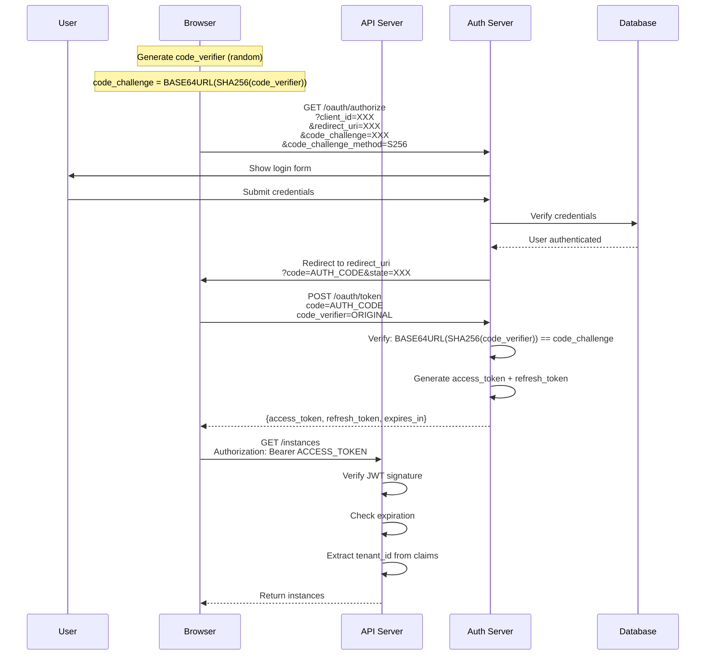

# Security Documentation

**Version**: 1.0.0
**Classification**: Internal
**Last Updated**: 2025-11-18
**Next Review**: 2026-02-18

---

## Table of Contents

1. [Overview](#overview)
2. [Threat Model (STRIDE)](#threat-model-stride)
3. [Security Architecture](#security-architecture)
4. [Authentication & Authorization](#authentication--authorization)
5. [Data Protection](#data-protection)
6. [OWASP Top 10 Mitigations](#owasp-top-10-mitigations)
7. [Compliance Requirements](#compliance-requirements)
8. [Security Testing](#security-testing)
9. [Incident Response Plan](#incident-response-plan)
10. [Security Checklist](#security-checklist)

---

## 1. Overview

This document defines the security posture of the WhatsApp Meta API Adapter. Given that this system handles **sensitive business communications**, security is paramount.

### Security Objectives

| Objective | Description | Priority |
|-----------|-------------|----------|
| **Confidentiality** | Protect message content and user data | CRITICAL |
| **Integrity** | Prevent unauthorized modification of data | CRITICAL |
| **Availability** | Ensure system uptime (99.9%+) | HIGH |
| **Auditability** | Complete audit trail for compliance | HIGH |
| **Non-repudiation** | Prove message origin and delivery | MEDIUM |

###

 Threat Level Assessment

**Overall Risk**: **HIGH**

**Reasoning**:
- Handles sensitive business communications
- Multi-tenant architecture (tenant isolation critical)
- WhatsApp may ban numbers for ToS violations
- Potential for message interception or tampering
- GDPR/LGPD compliance required
- Target for abuse (spam, phishing)

---

## 2. Threat Model (STRIDE)

### STRIDE Methodology

| Threat | Description | Likelihood | Impact | Risk |
|--------|-------------|------------|--------|------|
| **Spoofing** | Attacker impersonates user/tenant | MEDIUM | CRITICAL | HIGH |
| **Tampering** | Message content modified in transit | LOW | CRITICAL | MEDIUM |
| **Repudiation** | User denies sending message | MEDIUM | MEDIUM | MEDIUM |
| **Information Disclosure** | Unauthorized access to messages/data | HIGH | CRITICAL | CRITICAL |
| **Denial of Service** | System overwhelmed by requests | HIGH | HIGH | HIGH |
| **Elevation of Privilege** | User gains admin access | MEDIUM | CRITICAL | HIGH |

### 2.1 Spoofing Threats

#### Threat S1: OAuth2 Token Theft

**Description**: Attacker steals access token and impersonates user.

**Attack Vector**:
- XSS attack extracts token from browser storage
- Man-in-the-middle (MitM) intercepts token
- Malware on user device

**Mitigations**:
- ✅ Use `httpOnly` cookies for tokens (not localStorage)
- ✅ Short token expiry (1 hour)
- ✅ Refresh token rotation (one-time use)
- ✅ TLS 1.3 enforced (prevent MitM)
- ✅ Content Security Policy (CSP) headers
- ✅ Token binding to IP address (optional)

**Residual Risk**: LOW

---

#### Threat S2: Tenant Impersonation

**Description**: Attacker accesses another tenant's data.

**Attack Vector**:
- SQL injection bypasses tenant_id filter
- JWT manipulation changes tenant_id claim
- Insecure direct object reference (IDOR)

**Mitigations**:
- ✅ Parameterized SQL queries (no string concatenation)
- ✅ JWT signature verification (RS256)
- ✅ Tenant ID extracted from verified token, not request
- ✅ Row-level security (RLS) in PostgreSQL
- ✅ All queries include `WHERE tenant_id = $1`
- ✅ Foreign key constraints enforce relationships

**Residual Risk**: LOW

---

### 2.2 Tampering Threats

#### Threat T1: Message Content Modification

**Description**: Attacker modifies message content in transit.

**Attack Vector**:
- MitM attack modifies HTTP request/response
- Database compromise modifies stored messages
- Memory corruption attack on Instance Manager

**Mitigations**:
- ✅ TLS 1.3 end-to-end (client → API → whatsmeow)
- ✅ Message integrity via WhatsApp E2EE (Signal Protocol)
- ✅ Database encryption at rest (AES-256)
- ✅ Hash messages on storage (detect tampering)
- ✅ Webhook payloads signed with HMAC-SHA256

**Residual Risk**: VERY LOW

---

#### Threat T2: Database Tampering

**Description**: Attacker gains database access and modifies data.

**Attack Vector**:
- SQL injection (already mitigated)
- Compromised database credentials
- Insider threat

**Mitigations**:
- ✅ Database credentials in secrets vault (not code/env)
- ✅ Least privilege database user (no DROP, ALTER)
- ✅ Audit logging enabled (pg_audit)
- ✅ Database backups with integrity verification
- ✅ Immutable audit log table (append-only)
- ✅ Multi-factor authentication for database access

**Residual Risk**: LOW

---

### 2.3 Repudiation Threats

#### Threat R1: Message Sender Denial

**Description**: User denies sending a message.

**Attack Vector**:
- User claims account was compromised
- Logs don't prove user identity

**Mitigations**:
- ✅ Complete audit trail in `api_logs` table
- ✅ Log IP address, user agent, timestamp
- ✅ OAuth2 access token tied to specific client
- ✅ Optional: Require 2FA for sensitive operations
- ✅ Message signed with tenant's webhook secret (proof)

**Residual Risk**: MEDIUM

---

### 2.4 Information Disclosure Threats

#### Threat I1: Unauthorized Message Access

**Description**: Attacker reads messages not intended for them.

**Attack Vector**:
- IDOR vulnerability (access message by ID)
- Missing authorization checks
- SQL injection reveals data
- Backup files exposed

**Mitigations**:
- ✅ Authorization check on EVERY endpoint
- ✅ Message queries always include tenant_id filter
- ✅ Parameterized SQL (prevent injection)
- ✅ Database encryption at rest
- ✅ Backup files encrypted and access-controlled
- ✅ No sensitive data in logs
- ✅ PII redacted in error messages

**Residual Risk**: LOW

---

#### Threat I2: Timing Attack on Phone Numbers

**Description**: Attacker determines if phone number is registered.

**Attack Vector**:
- Different response times for existing vs. non-existing numbers
- Error messages reveal existence

**Mitigations**:
- ✅ Constant-time comparison for lookups
- ✅ Generic error messages ("Invalid request")
- ✅ Rate limiting prevents enumeration attacks

**Residual Risk**: LOW

---

### 2.5 Denial of Service Threats

#### Threat D1: API Rate Limit Exhaustion

**Description**: Attacker exhausts tenant's rate limit quota.

**Attack Vector**:
- Attacker obtains valid access token
- Floods API with requests
- Tenant cannot send legitimate messages

**Mitigations**:
- ✅ Rate limiting per access token (not just tenant)
- ✅ Anomaly detection flags unusual traffic
- ✅ CAPTCHA on authentication endpoints
- ✅ IP-based rate limiting (WAF layer)
- ✅ Token revocation endpoint
- ✅ Alert tenant of unusual activity

**Residual Risk**: MEDIUM

---

#### Threat D2: Database Resource Exhaustion

**Description**: Expensive queries overload database.

**Attack Vector**:
- Unbounded pagination (limit=999999)
- Missing indexes cause full table scans
- Recursive queries

**Mitigations**:
- ✅ Maximum limit enforced (limit <= 100)
- ✅ All queries have indexes (EXPLAIN ANALYZE)
- ✅ Query timeout set (5 seconds)
- ✅ Connection pooling limits (max 100 connections)
- ✅ Statement timeout in PostgreSQL

**Residual Risk**: LOW

---

### 2.6 Elevation of Privilege Threats

#### Threat E1: Admin Panel Unauthorized Access

**Description**: Regular user gains admin access to dashboard.

**Attack Vector**:
- Missing role check on admin endpoints
- JWT manipulation adds admin role
- IDOR accesses other tenant's admin panel

**Mitigations**:
- ✅ Separate admin scope (`admin:access`)
- ✅ Role verified from JWT (not request parameter)
- ✅ JWT signature prevents tampering
- ✅ Admin actions require re-authentication
- ✅ Audit log for all admin actions

**Residual Risk**: LOW

---

#### Threat E2: SQL Injection to Admin

**Description**: SQL injection grants admin privileges.

**Attack Vector**:
- Malicious input: `admin' OR '1'='1`
- Updates user role to admin

**Mitigations**:
- ✅ Parameterized queries (NO string concatenation)
- ✅ ORM-like scanning (sqlx) validates types
- ✅ Input validation before database
- ✅ Least privilege database user (no GRANT)

**Residual Risk**: VERY LOW

---

## 3. Security Architecture

### 3.1 Defense in Depth (Layers)

```
┌─────────────────────────────────────────────┐
│ Layer 7: Application Security              │
│ - Input validation                          │
│ - Output encoding                           │
│ - Business logic authorization              │
└─────────────────────────────────────────────┘
                    ↓
┌─────────────────────────────────────────────┐
│ Layer 6: API Security                       │
│ - Rate limiting                             │
│ - OAuth2 authentication                     │
│ - JWT verification                          │
└─────────────────────────────────────────────┘
                    ↓
┌─────────────────────────────────────────────┐
│ Layer 5: Network Security                   │
│ - TLS 1.3                                   │
│ - WAF (Web Application Firewall)            │
│ - DDoS protection                           │
└─────────────────────────────────────────────┘
                    ↓
┌─────────────────────────────────────────────┐
│ Layer 4: Infrastructure Security            │
│ - Container isolation                       │
│ - Network policies (K8s)                    │
│ - Secrets management                        │
└─────────────────────────────────────────────┘
                    ↓
┌─────────────────────────────────────────────┐
│ Layer 3: Data Security                      │
│ - Encryption at rest                        │
│ - Database access control                   │
│ - Backup encryption                         │
└─────────────────────────────────────────────┘
                    ↓
┌─────────────────────────────────────────────┐
│ Layer 2: Logging & Monitoring               │
│ - Audit logs                                │
│ - Anomaly detection                         │
│ - Security alerts                           │
└─────────────────────────────────────────────┘
                    ↓
┌─────────────────────────────────────────────┐
│ Layer 1: Physical Security                  │
│ - Cloud provider security                   │
│ - Data center access control                │
└─────────────────────────────────────────────┘
```

### 3.2 Trust Boundaries

```
┌──────────────────────────────────────────────────────┐
│ UNTRUSTED ZONE                                       │
│                                                      │
│  ┌──────────────┐         ┌──────────────┐         │
│  │ Public       │         │ User         │         │
│  │ Internet     │────────▶│ Browser      │         │
│  └──────────────┘         └──────────────┘         │
│                                  │                   │
└──────────────────────────────────│───────────────────┘
                                   │ HTTPS (TLS 1.3)
                    ┌──────────────▼────────────────┐
                    │  TRUST BOUNDARY 1:            │
                    │  WAF + Rate Limiting          │
                    └──────────────┬────────────────┘
                                   │
┌──────────────────────────────────▼───────────────────┐
│ DMZ (Demilitarized Zone)                             │
│                                                      │
│  ┌──────────────────────────────────────────┐      │
│  │ API Server (Fiber)                       │      │
│  │ - OAuth2 verification                    │      │
│  │ - Input validation                       │      │
│  │ - Authorization checks                   │      │
│  └──────────────────┬───────────────────────┘      │
│                     │                               │
└─────────────────────│───────────────────────────────┘
                      │
       ┌──────────────▼────────────────┐
       │  TRUST BOUNDARY 2:            │
       │  Internal Network Firewall    │
       └──────────────┬────────────────┘
                      │
┌─────────────────────▼───────────────────────────────┐
│ INTERNAL ZONE (Trusted)                             │
│                                                     │
│  ┌──────────────┐  ┌──────────────┐  ┌──────────┐ │
│  │ PostgreSQL   │  │ Redis        │  │ RabbitMQ │ │
│  │ (encrypted)  │  │ (TLS)        │  │ (TLS)    │ │
│  └──────────────┘  └──────────────┘  └──────────┘ │
│                                                     │
│  ┌──────────────────────────────────────────┐     │
│  │ Instance Manager (whatsmeow)             │     │
│  │ - No direct internet access              │     │
│  │ - Connects via proxy                     │     │
│  └──────────────────────────────────────────┘     │
└─────────────────────────────────────────────────────┘
```

---

## 4. Authentication & Authorization

### 4.1 OAuth2 Authorization Code Flow with PKCE



### 4.2 JWT Structure

```json
{
  "header": {
    "alg": "RS256",
    "typ": "JWT",
    "kid": "key-2025-01"
  },
  "payload": {
    "iss": "https://api.whatsapp-adapter.example.com",
    "sub": "tenant_id",
    "aud": "whatsapp-adapter-api",
    "exp": 1700003600,
    "iat": 1700000000,
    "jti": "unique-token-id",
    "tenant_id": "01234567-89ab-cdef-0123-456789abcdef",
    "scopes": ["messages.send", "messages.read", "instances.manage"],
    "client_id": "oauth_client_xyz"
  },
  "signature": "..."
}
```

### 4.3 Token Security

**Access Token**:
- Algorithm: RS256 (asymmetric, public key verification)
- Expiry: 1 hour (short-lived)
- Storage: httpOnly cookie or Authorization header
- Scope: Specific permissions only

**Refresh Token**:
- Algorithm: Random 256-bit string (CSPRNG)
- Expiry: 30 days
- Storage: Encrypted in database (bcrypt hash)
- Rotation: Single-use (new refresh token on each refresh)
- Revocation: Invalidate token family on suspicious activity

### 4.4 Scope-Based Authorization

| Scope | Description | Endpoints |
|-------|-------------|-----------|
| `messages.send` | Send messages | POST /messages |
| `messages.read` | Read message history | GET /messages |
| `instances.manage` | Create/update/delete instances | POST/PATCH/DELETE /instances |
| `contacts.read` | View contacts | GET /contacts |
| `contacts.write` | Modify contacts | POST/PATCH/DELETE /contacts |
| `media.upload` | Upload media files | POST /media |
| `media.download` | Download media files | GET /media/{id}/download |
| `webhooks.configure` | Configure webhooks | PATCH /instances/{id}/webhook |
| `admin:access` | Admin dashboard access | All /admin/* endpoints |

### 4.5 Authorization Implementation

```go
// Middleware: Verify JWT and extract claims
func AuthMiddleware(c *fiber.Ctx) error {
    token := extractToken(c) // From Authorization header or cookie

    claims, err := verifyJWT(token)
    if err != nil {
        return fiber.NewError(401, "Invalid token")
    }

    // Check expiration
    if time.Now().Unix() > claims.ExpiresAt {
        return fiber.NewError(401, "Token expired")
    }

    // Store in context for later use
    c.Locals("tenant_id", claims.TenantID)
    c.Locals("scopes", claims.Scopes)

    return c.Next()
}

// Middleware: Check required scope
func RequireScope(scope string) fiber.Handler {
    return func(c *fiber.Ctx) error {
        scopes := c.Locals("scopes").([]string)

        if !contains(scopes, scope) {
            return fiber.NewError(403, "Insufficient permissions")
        }

        return c.Next()
    }
}

// Usage
app.Post("/messages",
    AuthMiddleware,
    RequireScope("messages.send"),
    handler.SendMessage,
)
```

---

## 5. Data Protection

### 5.1 Encryption at Rest

**Database Encryption**:
```sql
-- Enable transparent data encryption (TDE)
ALTER DATABASE whatsapp_adapter SET default_table_access_method = 'heap';

-- Encrypt specific columns (PII)
CREATE EXTENSION IF NOT EXISTS pgcrypto;

-- Example: Encrypt phone numbers
CREATE TABLE instances (
    id UUID PRIMARY KEY,
    phone_number_encrypted BYTEA,
    phone_number_iv BYTEA,
    ...
);

-- Insert encrypted
INSERT INTO instances (phone_number_encrypted, phone_number_iv)
VALUES (
    pgp_sym_encrypt('+5511999999999', 'encryption-key', 'cipher-algo=aes256'),
    gen_random_bytes(16)
);

-- Query decrypted
SELECT pgp_sym_decrypt(phone_number_encrypted, 'encryption-key') AS phone_number
FROM instances;
```

**File Storage Encryption**:
- S3: Server-Side Encryption with AWS KMS (SSE-KMS)
- GCS: Customer-Managed Encryption Keys (CMEK)
- Azure: Customer-Managed Keys in Azure Key Vault

### 5.2 Encryption in Transit

**TLS Configuration**:
```nginx
# Minimum TLS 1.3
ssl_protocols TLSv1.3;

# Strong ciphers only
ssl_ciphers 'TLS_AES_128_GCM_SHA256:TLS_AES_256_GCM_SHA384:TLS_CHACHA20_POLY1305_SHA256';

# Prefer server ciphers
ssl_prefer_server_ciphers on;

# HSTS (Force HTTPS)
add_header Strict-Transport-Security "max-age=31536000; includeSubDomains; preload" always;

# Certificate pinning (optional)
add_header Public-Key-Pins 'pin-sha256="base64=="; max-age=5184000; includeSubDomains';
```

### 5.3 Key Management

**Secrets Hierarchy**:
```
1. Master Encryption Key (MEK)
   ├── Stored in: AWS KMS / GCP Cloud KMS / HashiCorp Vault
   ├── Rotated: Annually
   └── Access: Automated only (no human access)

2. Data Encryption Keys (DEK)
   ├── Derived from: MEK
   ├── Used for: Database column encryption
   ├── Rotated: Quarterly
   └── Access: Application service account only

3. Application Secrets
   ├── OAuth2 client secrets
   ├── Webhook signing secrets
   ├── Database passwords
   ├── Stored in: Kubernetes Secrets (encrypted at rest)
   └── Injected via: Environment variables

4. User Secrets
   ├── Password hashes (bcrypt, cost=12)
   ├── 2FA TOTP secrets
   ├── Recovery codes
   └── Stored in: Database (hashed)
```

### 5.4 Sensitive Data Handling

**PII Classification**:

| Data Type | Classification | Encryption | Retention |
|-----------|---------------|------------|-----------|
| Email | PII | At rest | Account lifetime |
| Phone Number | PII | At rest + transit | Account lifetime |
| Message Content | Sensitive | E2EE + at rest | 90 days |
| IP Address | PII | Transit only | 30 days (logs) |
| OAuth Token | Credential | Transit + storage | Until expiry |
| Password | Credential | Hash (bcrypt) | Until changed |
| WhatsApp Session Keys | Secret | At rest (encrypted) | Session lifetime |

**Data Minimization**:
- ✅ Don't log message content (only metadata)
- ✅ Redact PII in error messages
- ✅ Truncate IP addresses in logs (192.168.1.xxx)
- ✅ Don't store credit card data (use Stripe tokens)
- ✅ Delete data on account deletion (GDPR right to erasure)

---

## 6. OWASP Top 10 Mitigations

### A01:2021 – Broken Access Control

**Vulnerability**: Users access resources they shouldn't.

**Mitigations**:
- ✅ Authorization check on EVERY endpoint
- ✅ Tenant ID from JWT (not request parameter)
- ✅ Database queries always filter by tenant_id
- ✅ Row-level security (RLS) in PostgreSQL
- ✅ Deny by default (whitelist approach)
- ✅ No direct object references (use UUIDs)

**Test**:
```bash
# Try accessing another tenant's instance
curl -H "Authorization: Bearer TENANT_A_TOKEN" \
  https://api.example.com/v1/instances/TENANT_B_INSTANCE_ID

# Should return 404 (not 403, to prevent enumeration)
```

---

### A02:2021 – Cryptographic Failures

**Vulnerability**: Sensitive data exposed due to weak crypto.

**Mitigations**:
- ✅ TLS 1.3 enforced (no SSLv3, TLS 1.0, 1.1)
- ✅ Strong cipher suites only (AES-256-GCM)
- ✅ Database encryption at rest (AES-256)
- ✅ Password hashing with bcrypt (cost=12)
- ✅ Secrets in vault (not code/environment)
- ✅ HSTS header (force HTTPS)
- ✅ Certificate validation

**Test**:
```bash
# Check TLS configuration
nmap --script ssl-enum-ciphers -p 443 api.example.com

# Verify no weak ciphers (DES, RC4, MD5)
```

---

### A03:2021 – Injection

**Vulnerability**: SQL/NoSQL/Command injection.

**Mitigations**:
- ✅ Parameterized queries (no string concatenation)
- ✅ ORM-like type checking (sqlx)
- ✅ Input validation (whitelist)
- ✅ Principle of least privilege (DB user can't DROP)
- ✅ Escape shell commands (or avoid altogether)
- ✅ Content Security Policy (prevent XSS)

**Example**:
```go
// ❌ VULNERABLE
query := fmt.Sprintf("SELECT * FROM users WHERE email = '%s'", email)
db.Query(query)

// ✅ SAFE
query := "SELECT * FROM users WHERE email = $1"
db.Query(query, email)
```

**Test**:
```bash
# Try SQL injection
curl -X POST https://api.example.com/v1/users \
  -d '{"email": "admin@example.com OR 1=1"}'

# Should be safely escaped, not executed
```

---

### A04:2021 – Insecure Design

**Vulnerability**: Flawed architecture/design.

**Mitigations**:
- ✅ Threat modeling (STRIDE) performed
- ✅ Security requirements in PRD
- ✅ Least privilege by default
- ✅ Defense in depth (multiple layers)
- ✅ Rate limiting prevents abuse
- ✅ Circuit breakers prevent cascading failures
- ✅ Fail securely (deny on error)

---

### A05:2021 – Security Misconfiguration

**Vulnerability**: Default passwords, verbose errors, open ports.

**Mitigations**:
- ✅ No default credentials
- ✅ Error messages generic (no stack traces in production)
- ✅ Unnecessary services disabled
- ✅ Security headers (CSP, X-Frame-Options, etc.)
- ✅ Regular security updates
- ✅ Hardened container images (distroless)
- ✅ Network segmentation (K8s NetworkPolicies)

**Security Headers**:
```go
app.Use(func(c *fiber.Ctx) error {
    c.Set("X-Content-Type-Options", "nosniff")
    c.Set("X-Frame-Options", "DENY")
    c.Set("X-XSS-Protection", "1; mode=block")
    c.Set("Referrer-Policy", "strict-origin-when-cross-origin")
    c.Set("Content-Security-Policy", "default-src 'self'")
    return c.Next()
})
```

---

### A06:2021 – Vulnerable and Outdated Components

**Vulnerability**: Using libraries with known vulnerabilities.

**Mitigations**:
- ✅ Dependency scanning (govulncheck, trivy)
- ✅ Automated updates (Dependabot)
- ✅ Pin versions (go.mod)
- ✅ Remove unused dependencies
- ✅ Subscribe to security advisories

**CI/CD Check**:
```bash
# Run in GitHub Actions on every commit
govulncheck ./...
trivy fs --severity HIGH,CRITICAL .
```

---

### A07:2021 – Identification and Authentication Failures

**Vulnerability**: Weak authentication, session hijacking.

**Mitigations**:
- ✅ OAuth2 with PKCE (prevent code interception)
- ✅ Multi-factor authentication (TOTP)
- ✅ Strong password requirements (zxcvbn)
- ✅ Account lockout after 5 failed attempts
- ✅ Session timeout (1 hour for access token)
- ✅ Refresh token rotation
- ✅ No credentials in URLs
- ✅ Secure session cookies (httpOnly, secure, sameSite)

**Password Policy**:
```go
func ValidatePassword(password string) error {
    if len(password) < 12 {
        return errors.New("password must be at least 12 characters")
    }
    if !hasUppercase(password) {
        return errors.New("password must contain uppercase letter")
    }
    if !hasLowercase(password) {
        return errors.New("password must contain lowercase letter")
    }
    if !hasDigit(password) {
        return errors.New("password must contain digit")
    }
    if !hasSpecial(password) {
        return errors.New("password must contain special character")
    }
    // Check against common passwords
    if isCommonPassword(password) {
        return errors.New("password too common")
    }
    return nil
}
```

---

### A08:2021 – Software and Data Integrity Failures

**Vulnerability**: Unsigned updates, insecure CI/CD.

**Mitigations**:
- ✅ Code signing for releases
- ✅ Container image signing (cosign)
- ✅ Dependency verification (go.sum)
- ✅ CI/CD security (signed commits)
- ✅ Artifact attestation
- ✅ Webhook signature verification (HMAC)

**Webhook Signature**:
```go
func VerifyWebhookSignature(payload []byte, signature, secret string) bool {
    mac := hmac.New(sha256.New, []byte(secret))
    mac.Write(payload)
    expectedSignature := "sha256=" + hex.EncodeToString(mac.Sum(nil))

    // Constant-time comparison (prevent timing attacks)
    return hmac.Equal([]byte(signature), []byte(expectedSignature))
}
```

---

### A09:2021 – Security Logging and Monitoring Failures

**Vulnerability**: No alerts, logs not monitored.

**Mitigations**:
- ✅ Structured logging (JSON)
- ✅ Centralized log aggregation (Loki)
- ✅ Security event detection
- ✅ Real-time alerts (Prometheus Alertmanager)
- ✅ Audit logs immutable (append-only table)
- ✅ Log retention policy (90 days)
- ✅ No sensitive data in logs

**Security Events to Log**:
- Authentication failures
- Authorization denials
- Rate limit violations
- SQL injection attempts
- Unusual API access patterns
- Admin actions
- Data exports
- Configuration changes

**Alert Rules**:
```yaml
# Prometheus alerting rule
- alert: MultipleAuthFailures
  expr: rate(auth_failures_total[5m]) > 10
  for: 1m
  labels:
    severity: warning
  annotations:
    summary: "Multiple authentication failures detected"
    description: "{{ $value }} auth failures/min for tenant {{ $labels.tenant_id }}"
```

---

### A10:2021 – Server-Side Request Forgery (SSRF)

**Vulnerability**: Server makes requests to internal resources.

**Mitigations**:
- ✅ Whitelist allowed webhook URLs (no localhost, no private IPs)
- ✅ Validate URL scheme (only https://)
- ✅ Network egress filtering
- ✅ Disable HTTP redirects for webhooks
- ✅ Timeout on external requests

**Webhook URL Validation**:
```go
func ValidateWebhookURL(urlStr string) error {
    u, err := url.Parse(urlStr)
    if err != nil {
        return errors.New("invalid URL")
    }

    // Only HTTPS
    if u.Scheme != "https" {
        return errors.New("webhook URL must use HTTPS")
    }

    // Resolve hostname
    ips, err := net.LookupIP(u.Hostname())
    if err != nil {
        return errors.New("cannot resolve hostname")
    }

    // Block private IPs
    for _, ip := range ips {
        if isPrivateIP(ip) {
            return errors.New("webhook URL cannot point to private IP")
        }
    }

    return nil
}

func isPrivateIP(ip net.IP) bool {
    privateRanges := []string{
        "10.0.0.0/8",
        "172.16.0.0/12",
        "192.168.0.0/16",
        "127.0.0.0/8",
        "169.254.0.0/16",
    }
    for _, cidr := range privateRanges {
        _, ipnet, _ := net.ParseCIDR(cidr)
        if ipnet.Contains(ip) {
            return true
        }
    }
    return false
}
```

---

## 7. Compliance Requirements

### 7.1 GDPR (EU General Data Protection Regulation)

**Applicable**: Yes (handles EU users' data)

**Requirements**:

| Requirement | Implementation |
|-------------|----------------|
| **Lawful basis** | Consent + Legitimate interest |
| **Data minimization** | Only collect necessary data |
| **Purpose limitation** | Only use data for stated purpose |
| **Storage limitation** | Retention policies (90 days messages) |
| **Right to access** | API endpoint: GET /users/me/data |
| **Right to erasure** | API endpoint: DELETE /users/me |
| **Right to portability** | Export data in JSON format |
| **Right to rectification** | PATCH /users/me |
| **Data breach notification** | Within 72 hours |
| **Privacy by design** | Encryption, pseudonymization |
| **DPO** | Designate Data Protection Officer |

**Implementation**:
```go
// Right to access (GDPR Art. 15)
func (h *Handler) ExportUserData(c *fiber.Ctx) error {
    tenantID := c.Locals("tenant_id").(string)

    data := map[string]interface{}{
        "tenant": h.tenantRepo.FindByID(ctx, tenantID),
        "instances": h.instanceRepo.FindByTenantID(ctx, tenantID),
        "messages": h.messageRepo.FindByTenantID(ctx, tenantID),
        "contacts": h.contactRepo.FindByTenantID(ctx, tenantID),
    }

    return c.JSON(data)
}

// Right to erasure (GDPR Art. 17)
func (h *Handler) DeleteUserData(c *fiber.Ctx) error {
    tenantID := c.Locals("tenant_id").(string)

    // Soft delete (mark deleted_at)
    if err := h.tenantRepo.SoftDelete(ctx, tenantID); err != nil {
        return err
    }

    // Schedule hard delete after 30 days (grace period)
    h.scheduler.ScheduleHardDelete(tenantID, time.Now().Add(30*24*time.Hour))

    return c.SendStatus(204)
}
```

---

### 7.2 LGPD (Brazil Lei Geral de Proteção de Dados)

**Applicable**: Yes (Brazilian company/users)

**Requirements**: Similar to GDPR
- Data minimization
- Consent management
- Rights to access, correction, deletion
- Privacy impact assessment
- Security measures
- Data breach notification (ANPD)

---

### 7.3 HIPAA (USA - if handling health data)

**Applicable**: Only if handling Protected Health Information (PHI)

**Requirements**:
- Administrative safeguards
- Physical safeguards
- Technical safeguards
- Breach notification
- Business Associate Agreements (BAA)

**Note**: WhatsApp messages may contain health information. If targeting healthcare clients, HIPAA compliance required.

---

### 7.4 SOC 2 Type II (Optional - for enterprise clients)

**Control Categories**:
- Security
- Availability
- Processing Integrity
- Confidentiality
- Privacy

**Implementation Roadmap**: 6-12 months

---

## 8. Security Testing

### 8.1 Static Application Security Testing (SAST)

**Tools**:
```bash
# Go security scanner
gosec -fmt=json -out=gosec-report.json ./...

# Vulnerability database
govulncheck ./...

# License compliance
go-licenses check ./...
```

### 8.2 Dynamic Application Security Testing (DAST)

**Tools**:
- OWASP ZAP (automated scans)
- Burp Suite (manual testing)
- nuclei (template-based scanning)

**Test Scenarios**:
- SQL injection
- XSS (reflected, stored, DOM-based)
- CSRF
- Authentication bypass
- Authorization bypass
- SSRF
- XXE (XML External Entity)

### 8.3 Penetration Testing

**Frequency**: Annually (minimum)

**Scope**:
- External network (API endpoints)
- Internal network (if applicable)
- Web dashboard
- Mobile app (if applicable)

**Methodology**: OWASP Testing Guide

**Deliverables**:
- Executive summary
- Technical findings with severity
- Proof of concept (PoC)
- Remediation recommendations
- Retest verification

---

## 9. Incident Response Plan

### 9.1 Incident Classification

| Severity | Description | Response Time | Escalation |
|----------|-------------|---------------|------------|
| **P0 - Critical** | Data breach, system down | Immediate | CTO, CEO |
| **P1 - High** | Partial outage, vulnerability | < 1 hour | Security Team |
| **P2 - Medium** | Degraded performance | < 4 hours | On-call Engineer |
| **P3 - Low** | Minor issue | < 24 hours | Engineering Team |

### 9.2 Incident Response Phases

#### Phase 1: Detection & Triage (0-15 minutes)

```markdown
1. Alert received (monitoring system)
2. On-call engineer investigates
3. Determine severity
4. Create incident ticket
5. Notify incident commander
```

#### Phase 2: Containment (15-60 minutes)

```markdown
1. Isolate affected systems
2. Block malicious traffic (if attack)
3. Revoke compromised credentials
4. Preserve evidence (logs, memory dumps)
5. Create incident war room (Slack)
```

#### Phase 3: Eradication (1-4 hours)

```markdown
1. Identify root cause
2. Remove malware/backdoors
3. Patch vulnerabilities
4. Update firewall rules
5. Reset credentials
```

#### Phase 4: Recovery (4-24 hours)

```markdown
1. Restore from clean backups
2. Verify system integrity
3. Monitor for re-infection
4. Gradually restore service
5. Communicate with users
```

#### Phase 5: Post-Incident (1-2 weeks)

```markdown
1. Write post-mortem (blameless)
2. Document lessons learned
3. Implement preventive measures
4. Update runbooks
5. Conduct retrospective
```

### 9.3 Data Breach Response

**GDPR Requirement**: Notify within 72 hours

**Steps**:
```markdown
1. Contain breach immediately
2. Assess scope (which data, how many users)
3. Notify DPO/legal team
4. Notify supervisory authority (ANPD, ICO, etc.)
5. Notify affected users (email)
6. Offer remediation (credit monitoring if PII exposed)
7. Update privacy notice
8. File incident report
```

**Template Email to Users**:
```
Subject: Important Security Notice

Dear [User],

We are writing to inform you of a security incident that may have affected your account.

What happened:
[Brief description]

What data was affected:
[List data types]

What we're doing:
[Containment and remediation steps]

What you should do:
- Change your password immediately
- Enable two-factor authentication
- Monitor your account for unusual activity

We sincerely apologize for this incident. Your trust is our priority.

For questions, contact: security@whatsapp-adapter.example.com

[Company Name]
[Date]
```

---

## 10. Security Checklist

### Pre-Deployment Security Checklist

**Code**:
- [ ] No hardcoded secrets or credentials
- [ ] All inputs validated
- [ ] SQL queries parameterized
- [ ] Error messages generic (no stack traces)
- [ ] Logging does not contain PII
- [ ] Dependencies scanned for vulnerabilities
- [ ] Code reviewed by security team
- [ ] Unit tests pass (80%+ coverage)
- [ ] Integration tests pass
- [ ] SAST scan passed (gosec)

**Infrastructure**:
- [ ] TLS 1.3 enforced
- [ ] Security headers configured
- [ ] Rate limiting enabled
- [ ] WAF configured
- [ ] DDoS protection active
- [ ] Firewall rules restrictive (deny by default)
- [ ] Secrets in vault (not environment)
- [ ] Container images scanned (trivy)
- [ ] Network segmentation configured
- [ ] Monitoring and alerting operational

**Database**:
- [ ] Encryption at rest enabled
- [ ] Strong password for database user
- [ ] Least privilege access (no GRANT, DROP)
- [ ] Backup encryption enabled
- [ ] Audit logging enabled
- [ ] Connection pooling configured
- [ ] Query timeouts set

**Authentication**:
- [ ] OAuth2 properly implemented
- [ ] JWT signature verification
- [ ] Token expiration enforced
- [ ] Refresh token rotation
- [ ] 2FA available (optional for users)
- [ ] Account lockout after failed attempts

**Authorization**:
- [ ] Tenant isolation enforced
- [ ] Scope-based permissions
- [ ] Admin endpoints protected
- [ ] IDOR prevention (UUIDs)
- [ ] Authorization checked on every endpoint

**Compliance**:
- [ ] Privacy policy published
- [ ] Terms of service published
- [ ] Data retention policy documented
- [ ] GDPR rights implemented (access, erasure)
- [ ] Cookie consent banner (if EU users)
- [ ] Data breach notification procedure

**Incident Response**:
- [ ] Runbooks documented
- [ ] On-call rotation scheduled
- [ ] Backup/restore tested
- [ ] Disaster recovery plan
- [ ] Security team contacts updated

---

## Appendix A: Security Tools

### Development
- `gosec` - Go security scanner
- `govulncheck` - Vulnerability database
- `go-licenses` - License compliance
- `trivy` - Container scanner

### Testing
- `OWASP ZAP` - DAST
- `Burp Suite` - Manual testing
- `nuclei` - Template scanning
- `sqlmap` - SQL injection testing

### Monitoring
- `Prometheus` - Metrics
- `Grafana` - Dashboards
- `Loki` - Log aggregation
- `Alertmanager` - Alerting

### Secrets
- `HashiCorp Vault` - Secrets management
- `AWS KMS` - Key management
- `SOPS` - Encrypted configs

---

## Appendix B: Security Contacts

| Role | Contact | Escalation |
|------|---------|------------|
| Security Team | security@example.com | Slack: #security |
| On-Call Engineer | oncall@example.com | PagerDuty |
| Incident Commander | incidents@example.com | Phone: +55... |
| DPO (Data Protection Officer) | dpo@example.com | Legal Team |

**External**:
- CERT/CC: cert@cert.org
- WhatsApp Security: security@whatsapp.com

---

## Document Version History

| Version | Date | Changes | Author |
|---------|------|---------|--------|
| 1.0.0 | 2025-11-18 | Initial security documentation | Claude AI |

---

**CONFIDENTIAL - Internal Use Only**

This document contains sensitive security information. Do not share publicly.
